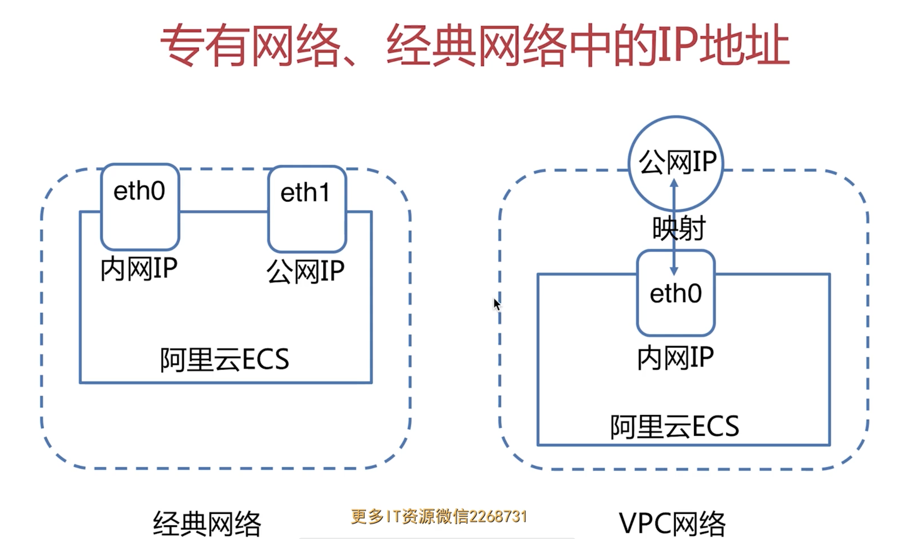
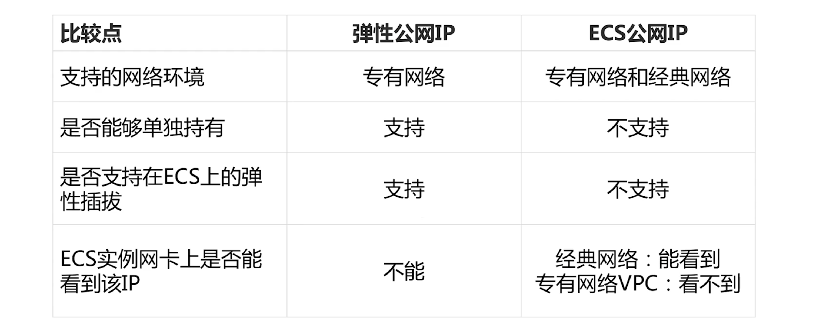

## 云端网络架构规划

经典网络:

阿里云一种传统模式、所有ECS直接建立在传统网络层之上。（局域网攻击）

专有网络VPC:

加入逻辑隔离的私有网络，可以自定义网络拓扑和IP 地址，支持通过专线连接。

（增加了一层隔离、系统更为安全，自定义内网IP结构、手工分配IP，可扩展型更强）

## 阿里云弹性公网 EIP

1个ECS实例只能同时绑定1个弹性公网IP，1个弹性公网IP同一时刻只能绑定到1个ECS实例上。

弹性公网IP 支持TCP/UDP/ICMP协议。不支持GRE，被动模式FTP等协议。

## 快照

### 快照原理

- 增量快照机制

ABCD => AB1C1D => AB2C1D

- 注意事项

1. 避开核心应用交叉影响
2. 自动快照执行前清理不必要的数据

### 手动快照

### 自动快照

## ECS镜像

