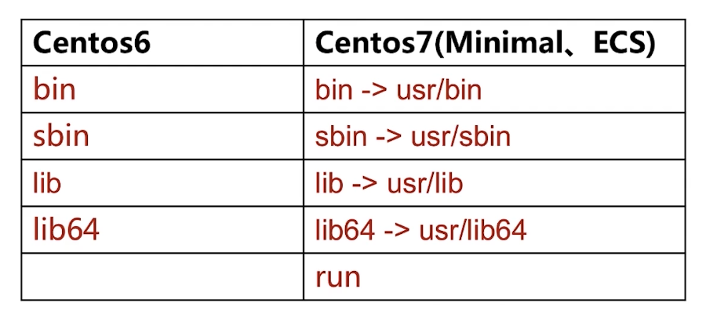

# Centos7

## 起源

Redhat => Centos

## Centos 6 => 7

1. 文件系统 ext4 => xfs
2. 修改主机名 /etc/sysconfig =>/network /etc/hostname
3. 修改时区 /etc/sysconfig/clock => timedatectl set timezone Asia/Tokyo
4. 查看1P信息 ifconfig => ip
5. 修改DNS地址 /etc/resolv.conf =>
6. 查看端口状态 netstat => ss
7. Core
   1. 操作 Centos6 Centos7
   2. 防火墙 iptables firewald
   3. 服务管理 System V init systemd
   4. 时间同步服务 ntp chrony
8. 其他
   1. Centos7默认支持docker
      1. 内核支持：OverlayFS
      2. Repo源支持
   2. 不再支持32位的操作系统
   3. GNOME 3.x
   4. 支持40G乙太网络卡

##  系统管理

```shell
[root@iZ0jl5vsyrdxxma5tn7rb9Z ~]# hostname Centos7-Casual
[root@iZ0jl5vsyrdxxma5tn7rb9Z ~]# hostname
Centos7-Casual
[root@iZ0jl5vsyrdxxma5tn7rb9Z ~]# 

# vim /etc/hostname
```

## 文件系统



## Timezone

```shell
[root@Centos7-Casual ~]# date
Wed Jul 27 11:46:15 CST 2022
[root@Centos7-Casual ~]# date -R
Wed, 27 Jul 2022 11:46:23 +0800

[root@Centos7-Casual Asia]# mv /etc/localtime /etc/localtime_back
[root@Centos7-Casual Asia]# cp /usr/share/zoneinfo/Asia/Tokyo /etc/localtime 
[root@Centos7-Casual Asia]# date -R
Wed, 27 Jul 2022 12:50:13 +0900
[root@Centos7-Casual Asia]# cp /etc/localtime_back /etc/localtime
cp: overwrite ‘/etc/localtime’? 
[root@Centos7-Casual Asia]# date -R
Wed, 27 Jul 2022 12:50:57 +0900
[root@Centos7-Casual Asia]# cp /etc/localtime_back /etc/localtime
cp: overwrite ‘/etc/localtime’? y
[root@Centos7-Casual Asia]# date -R
Wed, 27 Jul 2022 11:51:11 +0800
[root@Centos7-Casual Asia]# 
```

```shell
[root@Centos7-Casual Asia]# timedatectl
      Local time: Wed 2022-07-27 11:51:55 CST
  Universal time: Wed 2022-07-27 03:51:55 UTC
        RTC time: Wed 2022-07-27 11:51:55
       Time zone: n/a (CST, +0800)
     NTP enabled: no
NTP synchronized: yes
 RTC in local TZ: yes
      DST active: n/a
      
[root@Centos7-Casual Asia]# timedatectl set-timezone Asia/Tokyo
[root@Centos7-Casual Asia]# date -R
Wed, 27 Jul 2022 12:54:06 +0900
[root@Centos7-Casual Asia]# timedatectl set-timezone Asia/Shanghai
[root@Centos7-Casual Asia]# date -R
Wed, 27 Jul 2022 11:54:14 +0800

```

## Centos7操作系统网络接口命名

